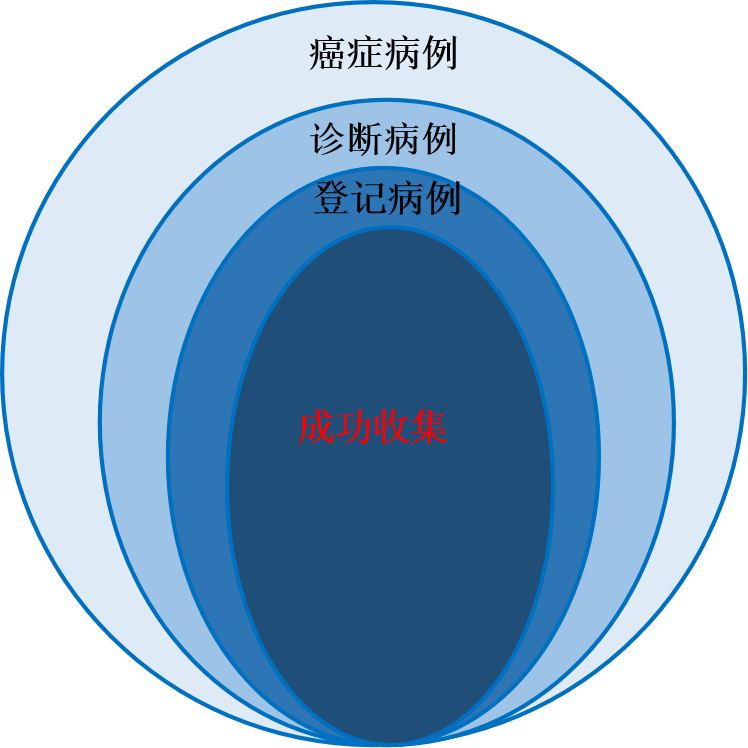

```{r setup1, include=FALSE}
options(htmltools.dir.version = FALSE)
options(servr.daemon = TRUE)
```

```{r xaringan-fit-screen, echo=FALSE}
xaringanExtra::use_fit_screen()
```

```{r xaringan-tile-view, echo=FALSE}
xaringanExtra::use_tile_view()
```

```{r xaringan-logo, echo=FALSE}
xaringanExtra::use_logo(
  image_url = "./logo-hospital.png",width="150px",height = "80px"
)

xaringanExtra::use_share_again()
```

```{css, echo=FALSE}
p {
  font-size: 24px;
}
```


```{r setup,include=FALSE}
knitr::opts_chunk$set(
	echo = FALSE,
	warning = FALSE
)
library(dplyr)
library(knitr)
library(kableExtra)
library(reshape2)
library(ggplot2)
library(tidyr)
library(gifski)
library(animation)
setwd("Y:/CanReg/statistic/data/tmpdata")
period<-20132017
site<- 410224
state.name<-c("开封市祥符区","洛阳市城区","孟津县","新安县","栾川县","嵩县","汝阳县","宜阳县","洛宁县","伊川县",
              "偃师市","鲁山县","林州市","鹤壁市城区","辉县市","濮阳市华龙区","濮阳县","禹州市","漯河市城区","漯河市郾城区",
              "漯河市源汇区","漯河市召陵区",
              "三门峡市湖滨区","南阳市卧龙区","内乡县","睢县","虞城县","信阳市浉河区","罗山县","沈丘县","郸城县",
              "西平县","济源市","固始县")

report<-haven::read_sas("./report.sas7bdat")
pro<-report%>%filter(name %in% c("全省"))
report<-report%>%filter((name %in% state.name))

registry<- report%>%
  select(areacode,name)%>%
  distinct(.keep_all = TRUE)


#率的统计学检验
report <- report%>%
  group_by(year,sex,code)%>%
  mutate(y_ics2000=sum(ics2000)/n(),
         a_ics2000=sum((ics2000-sum(ics2000)/n())^2/var_ics2000)/(n()-1),
         a_ics2000=ifelse(a_ics2000<=1,1,a_ics2000),
         z_ics2000=(ics2000-sum(ics2000)/n())^2/(a_ics2000*var_ics2000),
        
         y_dcs2000=sum(dcs2000)/n(),
         a_dcs2000=sum((dcs2000-sum(dcs2000)/n())^2/var_dcs2000)/(n()-1),
         a_dcs2000=ifelse(a_dcs2000<=1,1,a_dcs2000),
         z_dcs2000=(dcs2000-sum(dcs2000)/n())^2/(a_dcs2000*var_dcs2000),
         
         y_iws85=sum(iws85)/n(),
         a_iws85=sum((iws85-sum(iws85)/n())^2/var_iws85)/(n()-1),
         a_iws85=ifelse(a_iws85<=1,1,a_iws85),
         z_iws85=(iws85-sum(iws85)/n())^2/(a_iws85*var_iws85),
         
         y_dws85=sum(dws85)/n(),
         a_dws85=sum((dws85-sum(dws85)/n())^2/var_dws85)/(n()-1),
         a_dws85=ifelse(a_dws85<=1,1,a_dws85),
         z_dws85=(dws85-sum(dws85)/n())^2/(a_dws85*var_dws85),
         
         mvn=b5+b6+b7,
         p1=(b5+b6+b7)/fhj,
         p=sum(mvn)/sum(fhj),
         a_mv=sum((mvn-p*fhj)^2/(fhj*p1*(1-p1)))/(n()-1),
         z_mv=(mvn-p*fhj)^2/(a_mv*p1*(1-p1)*fhj),
        
         a_mi=sum(shj)/sum(fhj),
         aa_mi=sum((shj-a_mi*fhj)^2/((shj+fhj)*a_mi))/(n()-1),
         z_mi=(shj-a_mi*fhj)^2/(aa_mi*(shj+fhj)*a_mi),
         

diff2_ics2000=ifelse(z_ics2000>3.84 & ics2000/y_ics2000>1, paste0(">","(",round(ics2000/y_ics2000,1),")"),
              ifelse(z_ics2000>3.84 & ics2000/y_ics2000<1, paste0("<","(",round(ics2000/y_ics2000,1),")"),"")),
diff2_dcs2000=ifelse(z_dcs2000>3.84 & dcs2000/y_dcs2000>1, paste0(">","(",round(dcs2000/y_dcs2000,1),")"),
              ifelse(z_dcs2000>3.84 & dcs2000/y_dcs2000<1, paste0("<","(",round(dcs2000/y_dcs2000,1),")"),"")),
diff2_iws85=ifelse(z_iws85>3.84 & iws85/y_iws85>1, paste0(">","(",round(iws85/y_iws85,1),")"),
            ifelse(z_iws85>3.84 & iws85/y_iws85<1, paste0("<","(",round(iws85/y_iws85,1),")"),"")),
diff2_dws85=ifelse(z_dws85>3.84 & dws85/y_dws85>1, paste0(">","(",round(dws85/y_dws85,1),")"),
            ifelse(z_dws85>3.84 & dws85/y_dws85<1, paste0("<","(",round(dws85/y_dws85,1),")"),"")),
         
         diff_mi=ifelse(z_mi>3.84 & mi/a_mi>1,paste0(">","(",round(mi/a_mi,1),")"),
                        ifelse(z_mi>3.84 & mi/a_mi<1,paste0("<","(",round(mi/a_mi,1),")"),"")),
         diff_mv=ifelse(z_mv>3.84 & p1/p>1,paste0(">","(",round(p1/p,1),")"),
                        ifelse(z_mv>3.84 & p1/p<1,paste0("<","(",round(p1/p,1),")"),""))
         
         
         
         )%>%
  ungroup()%>%
  select(-a_ics2000,-z_ics2000,-a_dcs2000,-z_dcs2000,-y_iws85,-a_iws85,-z_iws85,-y_dws85,-a_dws85,-z_dws85,-mvn,-a_mv,-z_mv,-aa_mi,-z_mi)


#registry <- haven::read_sas("./registry.sas7bdat")
quality <- haven::read_sas("../code/quality.sas7bdat")
quality <- quality %>% mutate(city=ifelse(city==0,2,1),city=as.character(city))
#site <- unique(registry[registry$name==state,c("areacode")]$areacode)


#levels <- c(110,104,103,106,112,105,113,120,115,116,119,122)
#labels <- c("肺","胃","食管","肝","乳房","结直肠","宫颈","甲状腺","卵巢","前列腺","脑","白血病")

levels=c(122,121,120,119,113,112,105,103,106,104,110,62)
labels=c("白血病","淋巴瘤","甲状腺","脑","宫颈","乳房","结直肠","食管","肝","胃","肺","所有部位")


years<-report[report$areacode==site&!(report$year%in%c("20132017","20182022")),c("year")]$year
max<-as.numeric(max(years))
min<-as.numeric(min(years))
caption2<-paste0("图中>(O/E)或<(O/E)表示登记处指标与同期河南省各登记处的平均值相比具有统计学意义\n(O/E)表示登记处指标与平均值指标的比值")


cr_color_block <- function() {
  theme_classic()+
  theme(
    legend.title= element_blank(),
    legend.position= "top",
    strip.text= element_text(size=14,face="bold.italic"),
    strip.background= element_rect(color="white",size=0),
    axis.line= element_blank(),
    axis.ticks= element_blank(),
    axis.title= element_blank(),
    axis.text= element_text(size=12,face="bold.italic"),
    axis.text.x= element_text(face="bold.italic",angle = 90),
    plot.title= element_text(face="bold", size=14, hjust = 0.5),
    plot.subtitle = element_text(face="bold",size=12,hjust=0.5),
    plot.caption = element_text(size=10)
  )
}


cr_grid <- function() {
  theme_light()+
  theme(
    legend.title= element_blank(),
    legend.position= "bottom",
    strip.text= element_text(size=10,face="bold.italic"),
    strip.background= element_rect(color="white",size=0),
    axis.line.y= element_blank(),
    axis.ticks.y= element_blank(),
    axis.title= element_blank(),
    axis.text= element_text(size=9,face="bold.italic"),
    plot.title= element_text(face="bold", size=14, hjust = 0.5),
    plot.subtitle=element_text(face="bold.italic",size=12,hjust=0.5),
    # add border 1)
    panel.border = element_rect(colour = "blue", fill = NA, linetype = 2),
    # color background 2)
    panel.background = element_rect(fill = "aliceblue"),
    # modify grid 3)
    panel.grid.major.x = element_line(colour = "steelblue", linetype = 3, size = 0.5),
    panel.grid.minor.x = element_blank(),
    panel.grid.major.y =  element_line(colour = "steelblue", linetype = 3, size = 0.5),
    panel.grid.minor.y = element_blank()
  )
}

```

# 介绍

>1966年理查德·多尔爵士及其同事首次发表的《五大洲癌症发病率》（CI5）已成为癌症研究人员以及参与全球癌症控制计划规划、监测和评估的人员的宝贵资源。
 
 《五大洲癌症发病率》（CI5）在世界各地以人口为基础的癌症登记处、国际癌症登记协会（IACR）和国际癌症研究机构（IARC）之间提供了重要联系。

 第十二卷（CI5-XII）将收录2013-2017年期间登记处的癌症数据。

CI5 只接收IACR会员登记处数据！

***截止日期：2021年11月30日***

---
# Call for data

1. 发病数据：登记处2013-2017年发病数据

1. 人口数据：对应年份的官方普查数据，或两人口普查间/普查后估计的人口数据

1. 死亡率数据（如有）：最好来源于官方生命统计部门

1. ~~编码文件：如果编码规则与本文档要求的规则不同，则需提供编码文件~~

1. 完成在线调查问卷：提供登记处和覆盖人口群的详细情况

1. 登记处简介：描述登记处基本情况（在线调查问卷的一部分）

---
# 质量控制

>质量控制是五大洲发病率数据上报中非常重要的环节，登记处应根据质量控制结果核实补充完善登记处2013-2017年数据。

质量控制主要从以下几个方面进行审核：

  1. ***可比性***
  1. ***有效性***
  1. ***完整性***

>河南省肿瘤登记处根据《五大洲发病率》质量控制审核规则编制了***五大洲发病率可视化质量控制报告***，各登记处可根据报告中提示存在的问题，完善本登记处数据。

>同时，我们也邀请了领域内的专家对各登记处的数据质量进行了审核，具体结果可登录网址进行查看。

---
class: inverse fullscreen middle center
# 可比性评价
>癌症数据可比性评价通过对所采用的登记规则与所遵循的标准和定义作出的说明来确认（调查问卷中体现）。

---
# 评价登记处数据可比性时特别关注以下3个方面*：

1. 登记应用的肿瘤分类及编码系统；

1. 发病定义：发病日期与多原发肿瘤的判断规则（原发癌症（新发）与已有癌症的进展、复发及转移的区别）；

1. 无症状个体中检出病例的记录。


.footnote[[*] Purposes and use of cancer registration. Cancer Registration, Principles and Methods.Lyon,Freance:IARC,1991;No.95:7-21. ]


---
.pull-left[
## 发病的定义

1. 国际癌症研究署/国际肿瘤登记中心IARC/IACR(https://www.iarc.fr/, http://www.iacr.com.fr/)

1. ~~欧洲肿瘤登记协作网ENCR European Network of Cancer Registries (https://encr.eu/)~~

1. ~~美国 SEER Surveillance,Epidemiology,and End Results Program (https://seer.cancer.gov/)~~

]

.pull-right[
### IARC/IACR （1991）发病（日期）定义为

1. 到医院、诊所或研究机构因怀疑癌症问题 而首先就诊或入院的日期； 或者：

1. 由临床医生首先诊断或首先由病理学家报告（提及癌症）的日期；或者：

1. 死亡日期（DCO、尸检诊断的病例，其在存活时未怀疑过癌症）。

]

---
## 多原发肿瘤病例诊断规则

1. IARC/IACR/ENCR Rules (2004) (http://www.iacr.com.fr/images/doc/MPrules_july2004.pdf)

--

1. ~~SEER rules (https://seer.cancer.gov/tools/mphrules/)~~

--

1. ~~其他~~
--

1. ~~多元发病例判断规则未指定~~

---

## 无症状个体检出癌症病例的登记

- 主要有两类来源：

1. **筛查（cancer screening）**

--

1. ~~尸检~~
--

1. ~~非癌症疾病治疗时发现的癌症病例~~

- 偶发病例对目标人群的发病水平产生影响。

--

1. 筛查对发病率的影响

--

1. 过度诊断问题

--

1. 尸检的法规与实施强度

分性别、年龄组与癌种进行评价，描述和问卷表中的内容与登记数据相符合。

---

### 无症状个体检出癌症病例的登记

CI5问卷调查关于癌症筛查的问题：

1. 主要癌种类包括：乳腺癌、宫颈癌、结直肠癌、前列腺癌、口腔癌、其它

1. 各癌种筛查的年龄范围、覆盖人群比例（2015年）

1. 癌症筛查实施期间范围（起始年份、终止年份）

Note: Only programs where screening is provided by invitation to a well-defined section of general population should be reported.


---
# 五大洲数据审核程序介绍

>河南省肿瘤登记处按照《五大洲发病率》收录数据审核标准对河南省各登记处拟上报年份范围的数据质量进行了图形化>展示，各登记处可根据审核结果完善核实本登记处数据！

***本结果分如下几个部分：***

>1. 基本情况介绍 

>1. 人口数据审核

>1. 总体癌症发病死亡情况

>1. 主要部位癌症发病死亡情况

>1. 年龄别率

>1. 儿童肿瘤发病率/死亡率

>1. 主要质量控制指标情况(登记癌种数、MV%、M:I、DCO%)

---
class: fullscreen inverse middle center
# 人口数据审核

>人口数据质量对于肿瘤登记数据质量至关重要，本程序对于人口数据的审核从**人口总数**、**人口性别比例**、以>及**人口金字塔**等三个方面进行。

---
## 人口总数变化情况

>目前中国的人口出生率有所下降，但是人口数还是处于上升期，所以登记处的人口数应有缓慢上升的趋势，如果人口数排除（迁移、区划调整等），仍***出现较大波动***，则考虑数据来源可靠性，需仔细核实各年龄组数据。

.pull-left[

```{r,fig.height=5}
report %>%
  filter(areacode==site, code==62,!(sex=="合计"), !(year==period))%>%
  select(year,sex,rhj)%>%
  ggplot(aes(x=year,y=rhj,group=sex,colour=sex)) +
  geom_line(size=1.2)+
  geom_point(aes(colour=sex),size=2)+
  geom_text(aes(label=rhj))+
  xlab("年份")+
  ylab("人口数\n")+
  labs(title="历年人口实际数")+
  theme_classic()+
  theme(legend.position = c(0.1,1.0),
        legend.title = element_blank(),
        strip.text = element_text(size=10, face="bold.italic"),
        strip.background = element_rect(color="white", size=0),
        axis.text=element_text(size=10),
        plot.title = element_text(face="bold", size=14, hjust = 0.5))

```

]


.pull-right[

```{r,fig.height=5}
report %>% 
  filter(areacode==site,code==62,!(year==period))%>%
  select(year,sex,rhj)%>%
  group_by(sex)%>%
  mutate(percent=round(rhj/max(rhj)*100,2))%>%
  ggplot(aes(x=factor(year),y=percent))+
  geom_bar(aes(fill=sex),stat = "identity",position = "dodge")+
  facet_wrap(~sex,scales="free_y",nrow=3)+
  geom_text(aes(label=paste0(percent,"%")), vjust=1.6, color="black", size=4)+
  xlab("年份")+
  ylab("百分比（%）")+
  labs(title="人口总数变化情况（分性别）",
       caption="在比较人口数变化情况的时候，历年中最多的人口为MAX，设定其值为100%，其他年份的值为X/MAX*100%。")+
  theme_classic()+
  theme(legend.position = "none",
        strip.text = element_text(size=10,face="bold.italic"),
        strip.background = element_blank(),
        axis.text=element_text(size=10),
        axis.title=element_text(size=12,face="bold"),
        plot.title = element_text(face="bold", size=14,hjust = 0.5))

```


]

---
## 性别比例变化情况

.pull-left[

```{r,fig.height=6}
report %>%
  filter(areacode==site,code==62,!(sex=="合计"),!(year==period))%>%
    select(year,rhj,sex)%>%
    spread(sex,rhj)%>%
    rename(male="男性",female="女性")%>%
    mutate(ratio=round(male/female*100,1))%>%
    ggplot(aes(x=factor(as.numeric(year)),y=as.integer(ratio))) +
    geom_point(colour="red",size=4)+
  scale_y_continuous(breaks=scales::pretty_breaks())+
  xlab("年份")+
  ylab("性别比例（男性/女性）")+
  labs(title="人口数性别比例变化情况")+
  theme_classic()+
  theme(plot.title = element_text(face="bold",size=14,hjust = 0.5))
```


]

.pull-right[

>***性别比例***反映一个地区男女性别构成的情况，全国第七次人口普查数据结果显示，男女性别比为***105.07***（以女性为100计算）。

>登记处的性别比例在多年份之间应保持相对稳定，不应出现较大波动。

>如果出现较大波动则应考虑如下因素：

>1. 登记处区划调整（人口迁入迁出）
>1. 录入错误
>1. 登记处是否有学校等

]

---
## 人口金字塔变化情况

>人口金字塔是用类似古埃及金字塔的形象描绘人口年龄和性别分布状况的图形。能表明人口现状及其发展类型。

>图形的画法是：按男女人口年龄自然顺序自下而上在纵轴左右画成并列的横条柱，各条柱代表各个年龄组。底端标有按一定计算单位或百分比表示的人口数量，可见R程序*。

>人口金字塔可概括为三种类型：

>1. *扩张型* ，年轻人口组比重较大，从最低年龄组到最高年龄组依次逐渐缩小，塔形下宽上尖。
>1. *稳定型* ，除最老年龄组外，其余各年龄组大致相差不多，扩大或缩小均不明显，塔形较直。
>1. *收缩型* ，年轻人口组有规则的逐渐缩小，中年以上各组比重较大，塔形下窄上宽。


.footnote[[*] https://blog.csdn.net/weixin_40628687/article/details/81751203.]

---
## 历年人口结构动态变化

.pull-left[
```{r,fig.show='animate', animation.hook="gifski",fig.height=6}
for (i in min:max) {
 report %>%
  filter(areacode==site, code==62, !(sex=="合计"), year==i)%>%
  select(year,sex,r0:r85)%>%
  gather("agegrp","rks",-year,-sex)%>%
  mutate(agegrp=as.numeric(gsub("[^0-9]", "", agegrp)),
         rks=ifelse(sex=="男性",-rks,rks),
         agegrp=factor(agegrp,labels = c("0","1-4","5-9","10-14","15-19","20-24","25-29","30-34","35-39","40-44","45-49","50-54","55-59","60-64","65-69","70-74","75-79","80-84","85+")))%>%
  group_by(sex)%>%
  mutate(rks=round(rks/sum(rks),2),
         rks=ifelse(sex=="男性",-rks,rks))%>%
  ggplot(aes(x=factor(agegrp),y=rks,fill=sex)) +
  geom_bar(stat = "identity",position = "identity",color="black",size=0.25)+
  coord_flip()+
  theme_classic()+
  xlab("")+
  ylab("")+
  scale_y_continuous(limits = c(-0.12,0.12),breaks=seq(-0.12,0.12,0.02),labels = function(x) paste0(abs(x) * 100, '%'))+
  labs(title="历年人口金字塔变化情况",subtitle=paste(i))+
  theme(legend.position = c(0.1,0.9),
        legend.title = element_blank(),
        strip.text = element_text(size=10, face="bold.italic"),
        strip.background = element_rect(color="white", size=0),
        axis.text=element_text(size=10),
        axis.title=element_text(size=12, face="bold"),
        plot.title = element_text(face="bold", size=14, hjust = 0.5),
        plot.subtitle=element_text(face="bold",size=13,hjust=0.8,colour="tomato"))->p
  plot(p)
}

```
]

.pull-right[

```{r,fig.height=6}

pro %>%
  filter(areacode=="500000", code==62, !(sex=="合计"), year==period)%>%
  select(year,sex,r0:r85)%>%
  gather("agegrp","rks",-year,-sex)%>%
  mutate(agegrp=as.numeric(gsub("[^0-9]", "", agegrp)),
         rks=ifelse(sex=="男性",-rks,rks),
         agegrp=factor(agegrp,labels = c("0","1-4","5-9","10-14","15-19","20-24","25-29","30-34","35-39","40-44","45-49","50-54","55-59","60-64","65-69","70-74","75-79","80-84","85+")))%>%
  group_by(sex)%>%
  mutate(rks=round(rks/sum(rks)*100,2),
         rks=ifelse(sex=="男性",-rks,rks))%>%
  ggplot(aes(x=factor(agegrp),y=rks,fill=sex)) +
  geom_bar(stat = "identity",position = "identity",color="black",size=0.25)+
  coord_flip()+
  facet_wrap(~year,scales="free_x",nrow=1,drop=FALSE)+
  theme_classic()+
  labs(title=paste(min,"-",max,"年合计人口结构"))+
  theme(legend.position = "top",
        legend.title = element_blank(),
        strip.text = element_text(size=10, face="bold.italic"),
        strip.background = element_rect(color="white", size=0),
        axis.text=element_text(size=10),
        axis.title=element_blank(),
        plot.title = element_text(face="bold", size=14, hjust = 0.5))

```
]

---

### 历年人口结构逐年展示

```{r,fig.align='center',fig.height=7,fig.width=14}
report %>%
  filter(areacode==site, code==62, !(sex=="合计"), !(year==period))%>%
  select(year,sex,r0:r85)%>%
  gather("agegrp","rks",-year,-sex)%>%
  mutate(agegrp=as.numeric(gsub("[^0-9]", "", agegrp)),
         rks=ifelse(sex=="男性",-rks,rks),
         agegrp=factor(agegrp,labels = c("0","1-4","5-9","10-14","15-19","20-24","25-29","30-34","35-39","40-44","45-49","50-54","55-59","60-64","65-69","70-74","75-79","80-84","85+")))%>%
  group_by(year,sex)%>%
  mutate(rks=round(rks/sum(rks),2),
         rks=ifelse(sex=="男性",-rks,rks))%>%
  ggplot(aes(x=factor(agegrp),y=rks,fill=sex)) +
  geom_bar(stat = "identity",position = "identity",color="black",size=0.25)+
  coord_flip()+
  facet_wrap(~year,scales="free_x",nrow=1,drop=FALSE)+
  theme_classic()+
  xlab("")+
  ylab("")+
  scale_y_continuous(labels = function(x) paste0(abs(x) * 100, '%'))+
  ggtitle("历年人口金字塔变化情况")+
  theme(legend.position = "top",
        legend.title = element_blank(),
        strip.text = element_text(size=10, face="bold.italic"),
        strip.background = element_rect(color="white", size=0),
        axis.text=element_text(size=10),
        axis.text.x=element_text(size=8,angle=-90),
        axis.title=element_text(size=12, face="bold"),
        plot.title = element_text(face="bold", size=14, hjust = 0.5))

```

---
class: inverse fullscreen middle center
# 完整性评价

>登记地区中癌症新发总数记录在登记处数据库内的程度（以百分数表示），是登记数据质量的重要属性。

>完整性最大化时，所计算的癌症发生率与登记处覆盖人群中癌症发病率“真值”最接近。

---
## 完整性评价


.pull-left[

```{r, echo=FALSE, out.width = '80%',fig.align='center'}

```

]

.pull-right[

```{r, echo=FALSE, out.width = '80%',fig.align='center'}


```

]

---
## 完整性评价方法

- 以**同地区不同时期**作为对照数据进行比较获得的质控指标

- 以相同**区域内登记处合并值**作为对照数据进行比较获得的指控指标

#### 审核用以下4类指标评价完整性
.pull-left[

- 历史数据： 比较率的稳定性

  1. 发病/死亡数
  
  1. 总体发病率/总体死亡率、总体标化发病率/总体标化死亡率
  
  1. 分癌种标化发病率/死亡率

- 不同人群比较、与区域标准比较（国家总体平均水平、中国第11卷入选登记处数据）

]

.pull-right[

- 年龄别曲线

- 儿童癌症发病率

- 病理诊断比例(MV%)

- 死亡发病比(M:I)

- 只有死亡医学证明书比例（DCO%）

]
---
class: inverse fullscreen middle center
# 总体癌症发病死亡情况

---

.pull-left[

### 总体癌症发病数、死亡数

>以***比值比***直观审核登记处发病数(死亡数)可能存在的问题；

`$$比值比=\frac{发病数_i(死亡数_i)}{max(发病数_i(死亡数_i))}*100\left(\%\right)$$`

>发病数<sub>i</sub>/死亡数<sub>i</sub>为登记处第i年的发病数或死亡数

1. 发病数或者死亡数最高的年份为100%。

1. 一般各年份比值比变化不应超过5%；

1. 小于5%提示病例收集不全或；

1. 大于5%提示已收集病例可能存在重卡。
]


.pull-right[

```{r, fig.height=8}
report %>%
  filter(areacode==site, code==62, !(year==period)) %>%
  select(year,sex,fhj,shj) %>%
  gather("type","value",-year,-sex) %>%
  mutate(type=factor(type,levels=c("fhj","shj"),labels = c("发病数","死亡数")))%>%
  group_by(type,sex)%>%
  mutate(ratio=round(value/max(value)*100,1))%>%
  ggplot(aes(x=factor(as.numeric(year)),y=value))+
  geom_bar(aes(fill=sex),stat = "identity",position = "dodge")+
  facet_grid(sex~type,scales="free_y")+
  geom_text(aes(label=value),vjust=1, color="white", size=3.5)+
  geom_text(aes(label=paste0(ratio,"%")),vjust=3, color="black", size=3.5)+
  theme_classic()+
  xlab("年份")+
  ylab("发病数、死亡数")+
  labs(title="历年发病数(死亡数)变化情况",
       caption="白色标签值为数的绝对值(单位：例)\n黑色标签值为相对与最高值的百分比（单位：%）")+
  theme(legend.position = "none",
        strip.text = element_text(size=10,face="bold.italic"),
        strip.background = element_rect(color="white",size=0),
        axis.text=element_text(size=10),
        axis.text.x = element_text(angle = 90, hjust = 1),
        axis.title=element_text(size=12,face="bold"),
        plot.title = element_text(face="bold", size=14, hjust = 0.5))

```
]


---
### 发病率的稳定性

- 粗发病率的稳定性，各年份之间比值比变化不超过5%；

- 各年份中标发病率与期间均值相比变化无统计学差异；

`$$Var(ASR)=\frac{\sum_{i=1}^n(a_i*w_i^2*100000/p_i)}{(\sum_{i=1}^{18}w_i)^2}$$`

p<sub>i</sub>为登记处第i各年龄组的人口数

a<sub>i</sub>为登记处第i各年龄组的年龄别率

w<sub>i</sub>为标准人口第i各年龄组的人口数

---
### 总体癌症发病率

```{r,fig.width=12,fig.align='center'}
report %>%
  filter(areacode==site,code==62)%>%
  select(year,sex,diff_ics2000,diff2_ics2000)%>%
  mutate(type="中标发病率")->diff

report %>%
  filter(areacode==site, code==62) %>%
  select(year,sex,ihj,ics2000) %>%
  gather("type","value",-year,-sex)%>%
  mutate(type=factor(type,levels=c("ihj","ics2000"),labels = c("发病率","中标发病率")),
         value=round(value,1))%>%
  group_by(type,sex)%>%
  mutate(ratio=round(value/max(value)*100,1))%>%
  left_join(diff,by=c("year","sex","type"))%>%
  ggplot(aes(x=factor(as.numeric(year)),y=value))+
  geom_bar(aes(fill=sex),stat = "identity",position = "dodge")+
  facet_grid(sex~type,scales="free_y")+
  geom_text(aes(label=value),vjust=1, color="white", size=5)+
  geom_text(aes(label=paste0(ratio,"%")),vjust=3, color="black", size=5)+
  geom_text(aes(label=ifelse(year==period,diff2_ics2000,diff_ics2000)),vjust=5, color="purple", size=5)+
  theme_classic()+
  xlab("年份")+
  ylab("发病率(1/10万)")+
  labs(title="历年总体癌症发病率变化情况",
       caption="白色标签值为率的绝对值(单位：1/10万)\n黑色标签值为相对与最高值的百分比（单位：%）\n紫色大于或小于符号为统计学检验结果，与五年均值相比差异有统计学意义。")+
  theme(legend.position = "none",
        strip.text = element_text(size=12,face="bold.italic"),
        strip.background = element_rect(color="white",size=0),
        axis.text=element_text(size=12),
        axis.text.x = element_text(angle = 90, hjust = 1),
        axis.title=element_text(size=12,face="bold"),
        plot.title = element_text(face="bold", size=14, hjust = 0.5),
        plot.caption=element_text(size=10))

```


---
### 总体癌症死亡率

```{r,fig.width=12,fig.align='center'}
report %>%
  filter(areacode==site,code==62)%>%
  select(year,sex,diff_dcs2000,diff2_dcs2000)%>%
  mutate(type="中标死亡率")->diff

report %>%
  filter(areacode==site, code==62) %>%
  select(year,sex,dhj,dcs2000) %>%
  gather("type","value",-year,-sex) %>%
  mutate(type=factor(type,levels=c("dhj","dcs2000"),labels = c("死亡率","中标死亡率")),
         value=round(value,1))%>%
  group_by(type,sex)%>%
  mutate(ratio=round(value/max(value)*100,1))%>%
  left_join(diff,by=c("year","sex","type"))%>%
  ggplot(aes(x=factor(as.numeric(year)),y=value))+
  geom_bar(aes(fill=sex),stat = "identity",position = "dodge")+
  facet_grid(sex~type,scales="free_y")+
  geom_text(aes(label=value),vjust=1, color="white", size=5)+
  geom_text(aes(label=ratio),vjust=3, color="black", size=5)+
  geom_text(aes(label=ifelse(year==period,diff2_dcs2000,diff_dcs2000)),vjust=5, color="purple", size=5)+
  theme_classic()+
  xlab("年份")+
  ylab("死亡率(1/10万)")+
  labs(title="历年总体癌症死亡率变化情况",
       caption="白色标签值为率的绝对值(单位：1/10万)\n黑色标签值为相对与最高值的百分比（单位：%）\n紫色大于或小于符号为统计学检验结果，与五年均值相比差异有统计学意义。")+
  theme(legend.position = "none",
        strip.text = element_text(size=12,face="bold.italic"),
        strip.background = element_rect(color="white",size=0),
        axis.text=element_text(size=12),
        axis.text.x = element_text(angle = 90, hjust = 1),
        axis.title=element_text(size=12,face="bold"),
        plot.title = element_text(face="bold", size=14, hjust=0.5),
        plot.caption=element_text(size=10))

```

---
class: inverse fullscreen middle center
# 主要部位恶性肿瘤***发病/死亡***情况
## 发病情况

---
### 发病数（构成比）情况
.pull-left[

```{r}
report %>%
  filter(areacode==site,code %in% levels,(sex=="男性"))%>%
  mutate(code=factor(code,levels=levels,labels=labels),
         ihj=paste(fhj,"(",round(fcon,1),")"))%>%
  select(year,code,sex,ihj)%>%
  mutate(year=as.numeric(year))%>%
  dcast(code+sex~year,value.var = "ihj")%>%
  arrange(sex,desc(code))%>%select(-sex)%>%
  kable(caption="各年份肿瘤发病数(构成比%)情况\n 男性")%>%
  kable_styling("striped",font_size = 12)%>%
  row_spec(0,font_size = 15)
```

]

.pull-right[

```{r}
report %>%
  filter(areacode==site,code %in% levels,(sex=="女性"))%>%
  mutate(code=factor(code,levels=levels,labels=labels),
         ihj=paste(fhj,"(",round(fcon,1),")"))%>%
  select(year,code,sex,ihj)%>%
  mutate(year=as.numeric(year))%>%
  dcast(code+sex~year,value.var = "ihj")%>%
  arrange(sex,desc(code))%>%select(-sex)%>%
  kable(caption="各年份肿瘤发病数(构成比%)情况\n 女性")%>%
  kable_styling("striped",font_size = 12) 
```

]


---
### 标化发病率变化（图示）
#### 稳定性评价

稳定性评价主要通过各年份标化发病率与期间（2013-2017）平均值对比，来展示各登记处率的稳定性，并进行统计学检验。

>1. ***直观展示***：主要部位恶性肿瘤标化发病率的数值大小通过对应色块的颜色深浅来表示，较深的颜色代表较高的值，如果不
>同年份之间色块出现跳跃则表示率变化波动较大。
>1. ***统计学检验***：按照五大洲发病率，标化率差异的统计学检验方法，比较各年份值与期间平均值相比有无统计学差异。


---

```{r,fig.width=14,fig.height=8,fig.align='center'}

report %>%
  filter(areacode==site,code %in% levels[-length(levels)],!(sex=="合计"))%>%
  mutate(code=factor(code,levels=levels[-length(levels)],labels=labels[-length(labels)]),
         ihj=round(ihj,1))%>%
  select(year,code,sex,ics2000,diff_ics2000,diff2_ics2000)%>%
  ggplot(aes(x=factor(as.numeric(year)),y=code)) +
  geom_tile(aes(fill=ics2000)) +
  geom_text(aes(label=ics2000), vjust=1.5, color="black", size=4)+
  geom_text(aes(label=ifelse(year==period,diff2_ics2000,diff_ics2000)),vjust=-0.1, color="blue", size=4)+
  scale_x_discrete(position = "top")+
  scale_fill_gradient(low="white", high="red")+
  facet_wrap(~sex, ncol=3, strip.position="bottom")+
  labs(title="主要部位恶性肿瘤历年标化发病率变化",
       caption="黑色标签值:粗发病率（1/10万）\n蓝色大于或小于符号为统计学检验结果，与五年均值相比差异有统计学意义。")+
  cr_color_block()
  
```


---
### 标化发病率变化（图示）
#### 与区域标准比较

本部分主要通过把标化发病率与河南省所有上报五大洲数据的平均指标相比来表示差异大小,指标为(O/E)。

>$$ (O/E)=\frac{登记处标化发病率}{同时期内所有上报五大洲登记处平均期望值} $$
>采用五大洲发病率第11卷统计学方法进行差异的统计学检验，“>”/“<”表示与期望值相比差异具有统计学意义。

---
```{r,fig.width=14,fig.height=8,fig.align='center'}

report %>%
  filter(areacode==site,code %in% levels[-length(levels)],!(sex=="合计"))%>%
  mutate(code=factor(code,levels=levels[-length(levels)],labels=labels[-length(labels)]),
         ihj=round(ihj,1))%>%
  select(year,code,sex,y_ics2000,ics2000,diff2_ics2000)%>%
  mutate(ratio=round(ics2000/y_ics2000,1))%>%
  ggplot(aes(x=factor(as.numeric(year)),y=code)) +
  geom_tile(aes(fill=ratio)) +
  geom_text(aes(label=ratio), vjust=1.5, color="black", size=4)+
  geom_text(aes(label=diff2_ics2000),vjust=-0.1, color="blue", size=4)+
  scale_x_discrete(position = "top")+
  scale_fill_gradient(low="white", high="red")+
  facet_wrap(~sex, ncol=3, strip.position="bottom")+
  labs(title="主要部位恶性肿瘤标化发病率与区域平均值对比",
       caption="黑色标签值:(O/E)")+
  cr_color_block()
  
```
---
class: inverse fullscreen middle center
# 主要部位恶性肿瘤***发病/死亡***情况
## 死亡情况

---
### 死亡数(构成比)情况

.pull-left[
```{r}
report %>%
  filter(areacode==site,code %in% levels,(sex=="男性"))%>%
  mutate(code=factor(code,levels=levels,labels=labels),
         dhj=paste(shj,"(",round(scon,1),")"))%>%
  select(year,code,sex,dhj)%>%
  mutate(year=factor(as.numeric(year)))%>%
  dcast(code+sex~year,value.var = "dhj")%>%
  arrange(sex,desc(code))%>%select(-sex)%>%
  kable(caption="各年份肿瘤死亡数(构成比%)情况\n 男性")%>%
  kable_styling("striped",font_size = 12) %>%
  row_spec(1:12,extra_css = "line-height: 15px;")

```
]

.pull-right[
```{r}
report %>%
  filter(areacode==site,code %in% levels,(sex=="女性"))%>%
  mutate(code=factor(code,levels=levels,labels=labels),
         dhj=paste(shj,"(",round(scon,1),")"))%>%
  select(year,code,sex,dhj)%>%
  mutate(year=factor(as.numeric(year)))%>%
  dcast(code+sex~year,value.var = "dhj")%>%
  arrange(sex,desc(code))%>%select(-sex)%>%
  kable(caption="各年份肿瘤死亡数(构成比%)情况\n 女性")%>%
  kable_styling("striped",font_size = 12)%>%
row_spec(1:12,extra_css = "line-height: 15px;")
```
]


---
### 标化死亡率变化
#### 稳定性评价

>稳定性评价主要通过各年份标化死亡率与期间（2013-2017）平均值对比，来展示各登记处率的稳定性，并进行统计学检验。

1. ***直观展示***：主要部位恶性肿瘤标化死亡率的数值大小通过对应色块的颜色深浅来表示，较深的颜色代表较高的值，如果不
>同年份之间色块出现跳跃则表示率变化波动较大。

1. ***统计学检验***：按照五大洲发病率，标化率差异的统计学检验方法，比较各年份值与期间平均值相比有无统计学差异。

---
```{r,fig.width=14,fig.height=8,fig.align='center'}
report %>%
  filter(areacode==site,code %in% levels[-length(levels)],!(sex=="合计"))%>%
  mutate(
    code=factor(code,levels=levels[-length(levels)],labels=labels[-length(labels)]),
    dhj=round(dhj,1))%>%
  select(year,code,sex,dcs2000,diff_dcs2000,diff2_dcs2000)%>%
  ggplot(aes(x=factor(as.numeric(year)),y=code)) +
  geom_tile(aes(fill=dcs2000)) +
  scale_x_discrete(position = "top")+
  geom_text(aes(label=dcs2000), vjust=1.5,color="black",  size=3.5)+
  geom_text(aes(label=ifelse(year==period,diff2_dcs2000,diff_dcs2000)), vjust=-0.1,color="blue",  size=3.5)+
  scale_fill_gradient(low="white", high="red")+
  facet_wrap(~sex, ncol=3, strip.position="bottom")+
  labs(title="主要部位恶性肿瘤历年标化死亡率变化",
       subtitle="稳定性评价",
       caption="黑色标签值:粗死亡率（1/10万）\n蓝色大于或小于符号为统计学检验结果，与五年均值相比差异有统计学意义。")+
  cr_color_block()

```

---
### 标化死亡率变化
#### 与区域标准比较

>本部分主要通过把标化死亡率与河南省所有上报五大洲数据的平均指标相比来表示差异大小,指标为(O/E)。

$$ (O/E)=\frac{登记处标化死亡率}{同时期内所有上报五大洲登记处平均期望值} $$

采用五大洲发病率第10卷统计学方法进行差异的统计学检验，“>”/“<”表示与期望值相比差异具有统计学意义。
---

```{r,fig.width=14,fig.height=8,fig.align='center'}

report %>%
  filter(areacode==site,code %in% levels[-length(levels)],!(sex=="合计"))%>%
  mutate(code=factor(code,levels=levels[-length(levels)],labels=labels[-length(labels)]),
         ihj=round(ihj,1))%>%
  select(year,code,sex,y_dcs2000,dcs2000,diff2_dcs2000)%>%
  mutate(ratio=round(dcs2000/y_dcs2000,1))%>%
  ggplot(aes(x=factor(as.numeric(year)),y=code)) +
  geom_tile(aes(fill=ratio)) +
  geom_text(aes(label=ratio), vjust=1.5, color="black", size=4)+
  geom_text(aes(label=diff2_dcs2000),vjust=-0.1, color="blue", size=4)+
  scale_x_discrete(position = "top")+
  scale_fill_gradient(low="white", high="red")+
  facet_wrap(~sex, ncol=3, strip.position="bottom")+
  labs(title="主要部位恶性肿瘤标化死亡率与区域平均值对比",
       caption="黑色标签值:(O/E)")+
  cr_color_block()
  
```
---
class: inverse fullscreen middle center
# 年龄别发病率/死亡率


1. 检查常见部位癌症分性别的***年龄别发病率/死亡率***曲线是质量评价流程的一个部分；

1. 发现年龄组发病率非正常波动（与预期望模式比较），
  如：率在上升年龄段（老年组）中的意外下降， 提示该年龄组发病存在漏报;
1. 同时也可检测年龄组人口分布存在的问题；


---

```{r,fig.width=14,fig.height=8,fig.align='center'}

  report %>% 
    filter(areacode==site,code%in%levels,year==period,!(sex=="合计"))%>%
    select(code,sex,by,i0:i85)%>%
    mutate(code=factor(code,levels=rev(levels),labels=rev(labels)))%>%
    gather("agegrp","rate",i0:i85)%>%
    mutate(agegrp=as.numeric(gsub("[^0-9]", "", agegrp)))%>%
  ggplot(aes(x=agegrp,y=rate,group=sex,colour=sex)) +
  geom_line(size=1.2)+
  facet_wrap(~code,scales="free",ncol=4,drop=FALSE)+
  xlab("年龄")+
  ylab("年龄别发病率(1/10万)")+
  labs(title="主要部位恶性肿瘤年龄别发病率",
       subtitle="2013-2017年")+
  theme_classic()+
  theme(legend.title=element_blank(),
        legend.position= "top",
        strip.text = element_text(size=13,face="bold.italic"),
        strip.background = element_blank(),
        plot.title= element_text(face="bold", size=16, hjust = 0.5),
        plot.subtitle= element_text(face="bold", size=14, hjust = 0.5))

```

---

```{r,fig.width=14,fig.height=8,fig.align='center'}

  report %>% 
    filter(areacode==site,code%in%levels,year==period,!(sex=="合计"))%>%
    select(code,sex,by,d0:d85)%>%
    mutate(code=factor(code,levels=rev(levels),labels=rev(labels)))%>%
    gather("agegrp","rate",d0:d85)%>%
    mutate(agegrp=as.numeric(gsub("[^0-9]", "", agegrp)))%>%
  ggplot(aes(x=agegrp,y=rate,group=sex,colour=sex)) +
  geom_line(size=1.2)+
  facet_wrap(~code,scales="free",ncol=4,drop=FALSE)+
  xlab("年龄")+
  ylab("年龄别死亡率(1/10万)")+
  labs(title="主要部位恶性肿瘤年龄别死亡率",
       subtitle="2013-2017年")+
  theme_classic()+
  theme(legend.title=element_blank(),
        legend.position= "top",
        strip.text = element_text(size=13,face="bold.italic"),
        strip.background = element_blank(),
        plot.title= element_text(face="bold", size=16, hjust = 0.5),
        plot.subtitle= element_text(face="bold", size=14, hjust = 0.5))

```
---
class: inverse fullscreen middle center
# 儿童癌症发病率（0-14岁）


1. 相对于成年人群，儿童癌症（所有部位合并）的发病率变异较小（儿童某些部位癌症发病率存在地区和种族差异）；

1. 分三个年龄组评价：0-4, 5-9，10-14；

1. 以前一时期的儿童癌症发病率为参照值，分性别、年龄组设定最低和最高值；

1. 发病率超出上下限定范围，认为存在漏报或重报的可能性。


---
.pull-left[
## 发病率稳定性评价

```{r,fig.height=6}
  report %>% 
  filter(areacode==site,code==62,!(sex=="合计")) %>%
  mutate(i0=(f0+f1)/(r0+r1)*100000)%>%
  select(year,sex,i0,i5,i10)%>%
  gather("agegrp","rate",i0:i10)%>%
  mutate(agegrp=factor(agegrp,
                       levels=c("i10","i5","i0"),
                       labels=c("10-14岁","5-9岁","0-4岁")),
         rate=round(rate,1))%>%
  ggplot(aes(x=factor(as.numeric(year)),y=agegrp)) +
  geom_tile(aes(fill=rate)) +
  scale_x_discrete(position = "top")+
  geom_text(aes(label=rate), vjust=0.5, color="black",  size=3.5)+
  scale_fill_gradient(low="white", high="darkred")+
  facet_wrap(~sex,  strip.position="bottom")+
  labs(title="历年儿童肿瘤发病率变化",
       subtitle="稳定性评价")+
  cr_color_block()
```
]


.pull-right[
## 发病率与区域标准比较
```{r,fig.height=6}
child <- data.frame(sex=c(rep("男性",3),c(rep("女性",3))),
                    agegrp=rep(c("0-4岁","5-9岁","10-14岁"),2),
                    lowest=c(12.6,8.9,9.0,12.1,7.0,8.2),
                    highest=c(26.4,17.9,17.2,23.7,13.0,16.0),
                    order=seq(1,6,1))

report %>% 
  filter(areacode==site,code==62,!(sex=="合计"),year==period) %>%
  mutate(i0=(f0+f1)/(r0+r1)*100000)%>%
  select(sex,i0,i5,i10)%>%
  gather("agegrp","rate",i0:i10)%>%
  mutate(agegrp=factor(agegrp,
                       levels=c("i10","i5","i0"),
                       labels=c("10-14岁","5-9岁","0-4岁")),
         rate=round(rate,1))%>%
  left_join(child,by=c("sex","agegrp"))%>%
  arrange(order)%>%
  mutate(order=factor(order,
                        levels=seq(1,6,1),
                        labels=paste(sex,agegrp)))%>%
  ggplot(aes(x=lowest, xend=highest, y=order))+
  geom_segment(aes(x=lowest, xend=highest, y=order, yend=order), color="black", size=0.5)+
  geom_point(aes(x=lowest),size=2)+
  geom_point(aes(x=highest),size=2)+
  geom_point(aes(x=rate),size=3.5,colour="red")+
  scale_x_continuous(position="top")+
  labs(title="儿童肿瘤发病率与CI5第10卷标准对比",
       subtitle="2013-2017年",
       caption="红色点代表2013-2017年合计儿童肿瘤发病率\n 哑铃图的两端点分别代表CI5第10卷数据的最低值和最高值")+
  cr_grid()

```
]

---
class: inverse fullscreen middle center
# 主要质量控制指标
## 历年癌种数变化情况

---
.pull-left[

## 历年癌种数变化情况
>登记处每年收集的癌种数在一定程度上反映了数据收集的完整性

]

.pull-right[
```{r,fig.height=7}
report %>%
  filter(areacode==site,!(fhj==0),code<=61)%>%
  select(year,sex,code,fhj) %>%
  group_by(year,sex) %>%
  summarise(n=n(),.groups = "keep") %>%
  ggplot(aes(x=factor(as.numeric(year)),y=n))+
  geom_bar(aes(fill=sex),stat = "identity",position = "dodge")+
  facet_wrap(~sex,scales="free_y",nrow=3)+
  geom_text(aes(label=n), vjust=1.6, color="black", size=4)+
  xlab("年份")+
  ylab("癌种数(个)")+
  labs(title="历年收集癌种数变化情况",
       substitle="稳定性评价")+
  theme_classic()+
  theme(legend.position = "none",
        strip.text = element_text(size=10,face="bold.italic"),
        strip.background = element_blank(),
        axis.text=element_text(size=10),
        axis.title=element_text(size=12,face="bold"),
        plot.title = element_text(face="bold", size=14,hjust = 0.5))

```

]

---
class: inverse fullscreen middle center
# 主要质量控制指标
## 病理诊断比例(MV%)变化

> $$ MV=\frac{时期内病理学确诊癌症病例数}{时期内所有癌症新发病例数}*100 $$

1. 过高的MV%提示登记处的病例来源过度依赖组织学、细胞学及血液学诊断，其他途径病例发现来源缺乏或不完善（完整性存在问题，漏报！）

1. 分性别、分癌种与适当的标准比较

1. （社会经济、医疗水平相似的地区，同一身份、国家内等）

---


.pull-left[
### 稳定性评价

>稳定性评价主要通过各年份病理诊断比例（MV%）与期间（2013-2017）平均值对比，来展示指标的稳定性，并进行统计学检验。

>1. ***直观展示***：主要部位恶性肿瘤MV%的数值大小通过对应色块的颜色深浅来表示，较深的颜色代表较高的值，如果不
>同年份之间色块出现跳跃则表示率变化波动较大。
]

.pull-right[

```{r,fig.height=7}
report %>%
  filter(areacode==site,code %in% levels,!(sex=="合计"))%>%
  mutate(
    code=factor(code,levels=levels,labels=labels),
    mv=round(mv,1))%>%
  select(year,code,sex,mv,diff_mv)%>%
  mutate(mv=ifelse(is.na(mv),0,mv))%>%
  ggplot(aes(x=factor(as.numeric(year)),y=code)) +
  geom_tile(aes(fill=mv)) +
  scale_x_discrete(position = "top")+
  geom_text(aes(label=mv), vjust=1, color="black",  size=3.5)+
  #geom_text(aes(label=diff_mv), vjust=-0.5, color="blue",  size=3.5)+
  scale_fill_gradient(low="white", high="darkred")+
  facet_wrap(~sex,  strip.position="bottom")+
  labs(title="历年病理诊断比例（MV%）变化情况",
       subtitle="稳定性评价",
       caption=caption2)+
  cr_color_block()

```
]

---


.pull-left[
### 与区域标准比较

本部分主要通过把MV与河南省所有上报五大洲数据的平均指标相比来表示差异大小,指标为(O/E)。

>$$ (O/E)=\frac{登记处MV}{同时期内所有上报五大洲登记处平均期望值} $$

>采用五大洲发病率第10卷统计学方法进行差异的统计学检验，“>”/“<”表示与期望值相比差异具有统计学意义。
]

.pull-right[
```{r,fig.height=7}
report %>%
  filter(areacode==site,code %in% levels[-length(levels)],!(sex=="合计"))%>%
  mutate(code=factor(code,levels=levels[-length(levels)],labels=labels[-length(labels)]))%>%
  select(year,code,sex,p1,p,diff_mv)%>%
  mutate(ratio=round(p1/p,1))%>%
  ggplot(aes(x=factor(as.numeric(year)),y=code)) +
  geom_tile(aes(fill=ratio)) +
  geom_text(aes(label=ratio), vjust=1.5, color="black", size=4)+
  geom_text(aes(label=diff_mv),vjust=-0.1, color="blue", size=4)+
  scale_x_discrete(position = "top")+
  scale_fill_gradient(low="white", high="red")+
  facet_wrap(~sex, ncol=3, strip.position="bottom")+
  labs(title="登记处MV%与区域平均值对比",
       caption="黑色标签值:(O/E)")+
  cr_color_block()
  
```

]


---

.pull-left[
### 与国家平均水平比较

>本部分指标通过登记处期间（2013-2017）MV%指标值与全国（城市和农村）平均指标值进行对比来展示该指标的合理性。

]
.pull-right[
```{r,fig.height=7}
report %>%
  filter(areacode==site,(code>=101&code<=122)|code==62,(sex=="合计"),year==period)%>%
  select(city,code,mv)%>%
  left_join(quality,by=c("city","code"))%>%
  arrange(desc(mv.y))%>%
  mutate(label=factor(label,unique(label)))%>%
  ggplot(aes(y=label)) +
    geom_point(aes(x=mv.x),colour="red",size=2) +
    geom_point(aes(x=mv.y),colour="blue",size=2)+
  scale_x_continuous(position = "top",breaks = seq(5,100,5))+
  labs(title="病理诊断比例（MV%）与国家平均水平标准比较",
       subtitle="2013-2017年",
       caption = "红色点为登记处指标值\n蓝色点为国家区域标准值，如果本登记地区为农村地区，则标准为国家农村地区，反之亦然")+
  cr_grid()

```

]

---
class: inverse fullscreen middle center
# 主要质量控制指标
## 死亡发病比（M:I）


>$$ M:I=\frac{时期内癌症死亡数}{时期内新发病例数} $$

1. M:I相对过大，提示*发病登记可能存在漏报*，同时还要考虑生命统计的数据完整性和有效性问题；

1. M:I相对过小，提示发病数据中有*重复记录*可能或*死亡漏报*；

1. M:I值大小与生存率以及 死亡证书质量（根本死因的准确性）相关；

1. M:I值应该与相似地区M:I值相近，不同年份之间M:I值不会有大的波动。

---


.pull-left[
### 稳定性评价

>稳定性评价主要通过各年份病理诊断比例（M:I）与期间（2013-2017）平均值对比，来展示指标的稳定性，并进行统计学检验。

>1. ***直观展示***：主要部位恶性肿瘤M:I的数值大小通过对应色块的颜色深浅来表示，较深的颜色代表较高的值，如果不同年份之间色块出现跳跃则表示率变化波动较大。

]

.pull-right[
```{r}
report %>%
  filter(areacode==site,code %in% levels,!(sex=="合计"))%>%
  mutate(
    code=factor(code,levels=levels,labels=labels),
    mi=round(mi,1))%>%
  select(year,code,sex,mi,diff_mi)%>%
  mutate(mi=ifelse(is.na(mi),0,mi))%>%
  ggplot(aes(x=factor(as.numeric(year)),y=code)) +
  geom_tile(aes(fill=mi)) +
  scale_x_discrete(position = "top")+
  geom_text(aes(label=mi), vjust=1, color="black",  size=3.5)+
 # geom_text(aes(label=diff_mi), vjust=-0.5, color="blue",  size=3.5)+
  scale_fill_gradient(low="white", high="darkred")+
  facet_wrap(~sex,  strip.position="bottom")+
  labs(title="历年死亡发病比（M:I）变化情况",
       caption=caption2)+
  cr_color_block()

```

]

---

.pull-left[
### 与区域标准比较

本部分主要通过把M:I与河南省所有上报五大洲数据的平均指标相比来表示差异大小,指标为(O/E)。

>$$ (O/E)=\frac{登记处M:I}{同时期内所有上报五大洲登记处平均期望值} $$

>采用五大洲发病率第10卷统计学方法进行差异的统计学检验，“>”/“<”表示与期望值相比差异具有统计学意义。

]

.pull-right[


```{r}

report %>%
  filter(areacode==site,code %in% levels[-length(levels)],!(sex=="合计"))%>%
  mutate(code=factor(code,levels=levels[-length(levels)],labels=labels[-length(labels)]))%>%
  select(year,code,sex,mi,a_mi,diff_mi)%>%
  mutate(ratio=round(mi/a_mi,1))%>%
  ggplot(aes(x=factor(as.numeric(year)),y=code)) +
  geom_tile(aes(fill=ratio)) +
  geom_text(aes(label=ratio), vjust=1.5, color="black", size=4)+
  geom_text(aes(label=diff_mi),vjust=-0.1, color="blue", size=4)+
  scale_x_discrete(position = "top")+
  scale_fill_gradient(low="white", high="red")+
  facet_wrap(~sex, ncol=3, strip.position="bottom")+
  labs(title="登记处MV%与区域平均值对比",
       caption="黑色标签值:(O/E)")+
  cr_color_block()
  
```

]

---


.pull-left[
### 与国家平均水平比较

>本部分指标通过登记处期间（2013-2017）M:I指标值与全国（城市和农村）平均指标值进行对比来展示该指标的合理性。

]
.pull-right[
```{r}
report %>%
  filter(areacode==site,(code>=101&code<=122)|code==62,(sex=="合计"),year==period)%>%
  select(city,code,mi)%>%
  left_join(quality,by=c("city","code"))%>%
  arrange(desc(mi.y))%>%
  mutate(label=factor(label,unique(label)))%>%
  ggplot(aes(y=label)) +
    geom_point(aes(x=mi.x),colour="red",size=2) +
    geom_point(aes(x=mi.y),colour="blue",size=2)+
  scale_x_continuous(position = "top",breaks=seq(0.1,1,0.1))+
  labs(title="死亡发病比（M:I）与国家平均水平比较",
       subtitle="2013-2017年",
       caption = "红色点为登记处指标值\n蓝色点为国家区域标准值，如果本登记地区为农村地区，则标准为国家农村地区，反之亦然")+
  cr_grid()

```

]

---
class: inverse fullscreen middle center
# 主要质量控制指标
## 只有死亡医学证明书比例(DCO%) 

---

.pull-left[
### 稳定性评价

```{r}
report %>%
  filter(areacode==site,code %in% levels,!(sex=="合计"))%>%
  mutate(
    code=factor(code,levels=levels,labels=labels),
    dco=round(dco,1))%>%
  select(year,code,sex,dco)%>%
  mutate(dco=ifelse(is.na(dco),0,dco))%>%
  ggplot(aes(x=factor(as.numeric(year)),y=code)) +
  geom_tile(aes(fill=dco)) +
  scale_x_discrete(position = "top")+
  geom_text(aes(label=dco), vjust=0.5, color="black",  size=3.5)+
  scale_fill_gradient(low="white", high="darkred")+
  facet_wrap(~sex,  strip.position="bottom")+
  labs(title="只有死亡医学证明书比例（DCO%）变化情况",
       subtitle="稳定性评价")+
  cr_color_block()

```
]

.pull-right[
### 与国家平均水平比较

```{r}
report %>%
  filter(areacode==site,(code>=101&code<=122)|code==62,(sex=="合计"),year==period)%>%
  select(city,code,dco)%>%
  left_join(quality,by=c("city","code"))%>%
  arrange(desc(dco.y))%>%
  mutate(label=factor(label,unique(label)))%>%
  ggplot(aes(y=label)) +
    geom_point(aes(x=dco.x),colour="red",size=2) +
    geom_point(aes(x=dco.y),colour="blue",size=2)+
  scale_x_continuous(position = "top")+
  labs(title="只有死亡医学证明书比例（DCO%）与国家平均水平比较",
       subtitle="2013-2017",
       caption = "红色点为登记处指标值\n蓝色点为国家区域标准值，如果本登记地区为农村地区，则标准为国家农村地区，反之亦然")+
  cr_grid()

```

]

---
class: fullscreen inverse middle center

# 相关安排


### 数据更新：直接在***网络直报管理系统***里在线更新
### 截止时间：***2021年11月1日***（河南省肿瘤登记直报系统）
### 提交国家质控： ***2021年8月30日***
### 质控报告：http://218.28.13.204:35556/CI5/index.html（每周更新）
### 调查问卷（*）：朴恒博士（zlyypiaoheng4562@zzu.edu.cn）

---
class: fullscreen inverse middle center

# 谢谢关注
>### 请各登记处在核实更新和完善本登记处五大洲数据的过程中遇到任何有关数据方面的疑问，请及时联系我们，河南省肿瘤登记处会尽力协助大家，做好数据上报工作！

### Qiong Chen @ Henan Cancer Hospital/Henan Cancer Center
